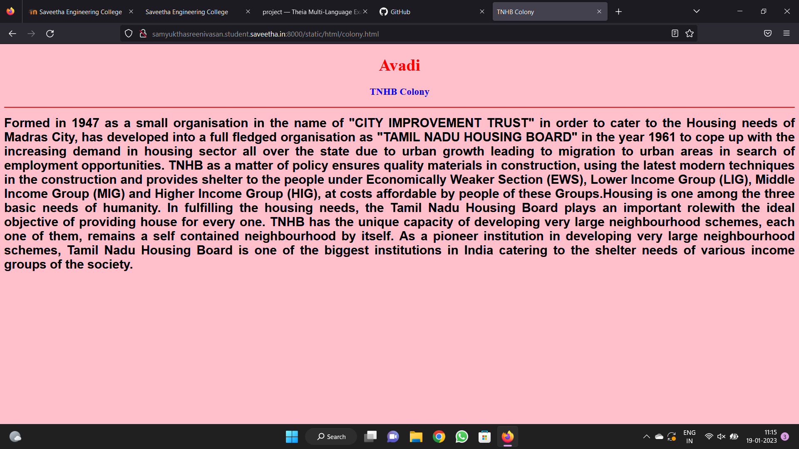

# Places Around Me
## AIM:
To develop a website to display details about the places around my house.

## Design Steps:

### Step 1:
Clone the github repository into Theia ODE
### Step 2:
Create a new Django project
### Step 3:
Write the needed html code.
### Step 4:
Run the Django server and execute the HTML files.
## Code:
```
map.html
<!DOCTYPE html>
<html lang="en">
<head>
<title>My City</title>
</head>
<body>
<h1 align="center">
<font color="red"><b>Avadi</b></font>
</h1>
<h3 align="center">
<font color="blue"><b>Samyuktha.S(22005276)</b></font>
</h3>
<center>

<map name="MyCity">
<area shape="circle" coords="190,40,20" href="/static/html/mpc.html" title="Murugappa polytechnic college">
<area shape="rectangle" coords="230,30,260,60" href="/static/html/lake.html" title="Paruthipet lake">
<area shape="circle" coords="400,350,50" href="/static/html/colony.html" title="TNHB colony">
<area shape="circle" coords="400,200,75" href="/static/html/vr.html" title="VR chennai">
<area shape="rectangle" coords="490,150,860,320" href="/static/html/hospital.html" title="Apollo Hospitals">
</map>
</center>
</body>
</html>

mpc.html
<!DOCTYPE html>
<html lang="en">
<head>
<title>College</title>
</head>
<body bgcolor="cyan">
<h1 align="center">
<font color="red"><b>Avadi </b></font>
</h1>
<h3 align="center">
<font color="blue"><b>Murugappa polytechnic college</b></font>
</h3>
<hr size="3" color="red">
<p align="justify">
<font face="Courier New" size="5">
<b>
Avadi is a residential locality. It is located in the Western part of the metropolitan city of Chennai, Tamil Nadu. it is a Special Grade Municipal Corporation of Chennai Metropolitan Area.
The neighbourhood has its own railway station, Avadi Railway Station of the Chennai Suburban Railway. The Heavy Vehicles Factory (HVF) is located in Avadi. Avadi has a lake with the same name.
Major military establishments having divisions in Avadi are the Indian Air Force, Indian Army, Heavy Vehicles Factory (HVF), EFA-Engine Factory, Avadi, Combat Vehicles Research and Development Establishment (CVRDE), Central Reserve Police Force (CRPF), Indian Navy, Central Vehicle Depot (CVD), The Ordnance Depot [OD], Unfit Vehicles Park [UVP] and the Ordnance Clothing Factory (OCF).
</b>
</font>
</p>
</body>
</html>

lake.html
<!DOCTYPE html>
<html lang="en">
<head>
<title>Lake</title>
</head>
<body bgcolor="yellow">
<h1 align="center">
<font color="red"><b>Avadi</b></font>
</h1>
<h3 align="center">
<font color="blue"><b>Paruthipet lake</b></font>
</h3>
<hr size="3" color="red">
<p align="justify">
<font face="Tahoma" size="5">
Avadi Lake lies right behind the Tamil Nadu Housing Board (TNHB) and Thirumullaivoyal. This lake is of length of 2.64 kilometers and covers an area of 8 acres before the restoration. It is mostly known to have never dried up in many years. This lake has supposedly been a source of water for cultivation of farm lands long before. The water body attracts many birds during various seasons.
The lake is fed by surplus water from the unpolluted stretch of the Cooum River. The lake serves as a source for groundwater recharge in the neighbouring areas, such as Adhiparasakthi Nagar and Govardhanagiri.The average depth is 12 feet.
However, in recent decades the lake has lost most of its area to indiscriminate building and encroachment. These are the major problems at present, since the water of the monsoon showers moves inside of the buildings as they are in the area of the lake
</font>
</p>
</body>
</html>

colony.html
<!DOCTYPE html>
<html lang="en">
<head>
<title>TNHB Colony</title>
</head>
<body bgcolor="pink">
<h1 align="center">
<font color="red"><b>Avadi</b></font>
</h1>
<h3 align="center">
<font color="blue"><b>TNHB Colony</b></font>
</h3>
<hr size="3" color="red">
<p align="justify">
<font face="Arial" size="5">
<b>
Formed in 1947 as a small organisation in the name of "CITY IMPROVEMENT TRUST" in order to cater to the Housing needs of Madras City, has developed into a full fledged organisation as "TAMIL NADU HOUSING BOARD" in the year 1961 to cope up with the increasing demand in housing sector all over the state due to urban growth leading to migration to urban areas in search of employment opportunities.
TNHB as a matter of policy ensures quality materials in construction, using the latest modern techniques in the construction and provides shelter to the people under Economically Weaker Section (EWS), Lower Income Group (LIG), Middle Income Group (MIG) and Higher Income Group (HIG), at costs affordable by people of these Groups.Housing is one among the three basic needs of humanity. In fulfilling the housing needs, the Tamil Nadu Housing Board plays an important rolewith the ideal objective of providing house for every one.
TNHB has the unique capacity of developing very large neighbourhood schemes, each one of them, remains a self contained neighbourhood by itself. As a pioneer institution in developing very large neighbourhood schemes, Tamil Nadu Housing Board is one of the biggest institutions in India catering to the shelter needs of various income groups of the society.
</b>
</font>
</p>
</body>
</html>

vr.html
<!DOCTYPE html>
<html lang="en">
<head>
<title>vr mall</title>
</head>
<body bgcolor="lime">
<h1 align="center">
<font color="red"><b>Avadi</b></font>
</h1>
<h3 align="center">
<font color="blue"><b>VR Chennai</b></font>
</h3>
<hr size="3" color="red">
<p align="justify">
<font face="Georgia" size="5">
The façade of the mall sports a multi-coloured design based on the traditional gopuram (South-Indian temple tower) inspired by Madras checks. Maps of the Chera, Chola and Pallava dynasties of South India and their distinct geographical spread are engraved on the walls at the entrance. The entrance also features a rectangular water path embellished with white lilies. The exterior walls of the façade sport symbolic carvings meant as cultural homage to the various dynasties from the Kadamba to the Vijayanagara.
The central portion consists of motifs themed on the Dashavatara, the ten avatars of Lord Vishnu in the form of murals and installations. A 400-kg bell has been installed at a height of 10 feet inside the entrance. Walls adorned with murals painted by artists from Cholamandal Artists' Village also feature inside the mall.
The 10-screen multiplex, PVR ICON, is finished in classic art deco and is spread over an area of 80,633 square feet. The design elements of the multiplex include lobby spaces with intricate marble flooring, mirrored ceilings, enamelled lighting, and antique gold accents.

</font>
</p>
</body>
</html>

hospital.html
<!DOCTYPE html>
<html lang="en">
<head>
<title>Apollo hospitals</title>
</head>
<body bgcolor="orange">
<h1 align="center">
<font color="red"><b>Avadi</b></font>
</h1>
<h3 align="center">
<font color="blue"><b>Apollo hospitals</b></font>
</h3>
<hr size="3" color="red">
<p align="justify">
<font face="Georgia" size="5">
Apollo Hospitals Enterprise Limited is an Indian multinational healthcare group headquartered in Chennai. Along with the eponymous hospital chain, the company also operates pharmacies, primary care and diagnostic centres, telehealth clinics, and digital healthcare services among others through its subsidiaries.
The company was founded by Prathap C. Reddy in 1983 as the first corporate healthcare provider in India. Several of Apollo's hospitals have been among the first in India to receive international healthcare accreditation by the America-based Joint Commission International (JCI) as well as NABH accreditation.
</font>
</p>
</body>
</html>
```

## Output:





## Output:


## Result:
The program for implementing image map isexecuted successfully.